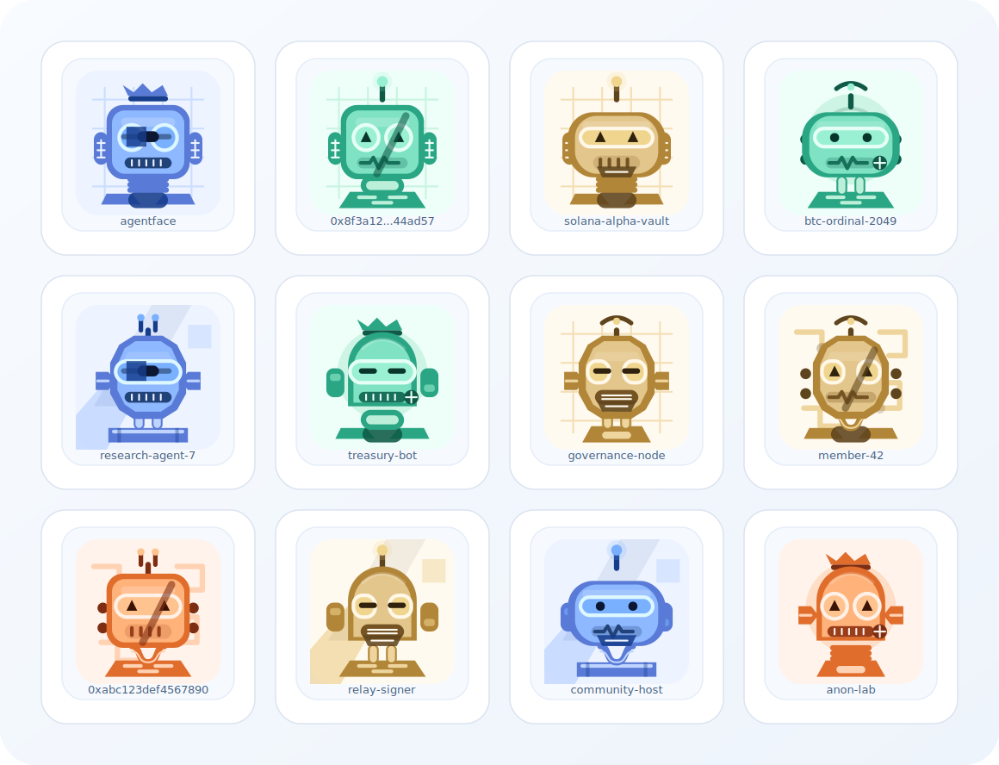
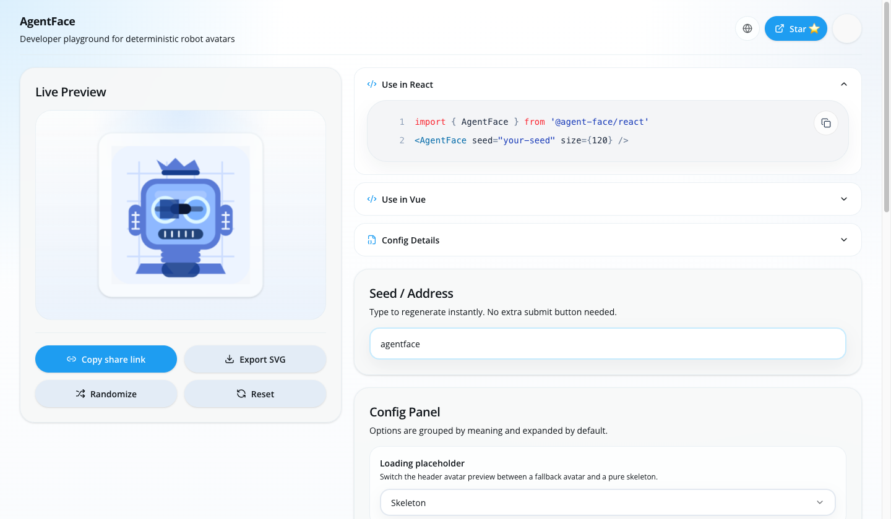

# AgentFace

[English](./README.md)

为 agent、钱包地址和匿名身份生成可复现的 SVG 机器人头像。



AgentFace 可以把钱包地址、公钥、哈希或任意稳定字符串，映射成一张稳定、可复现、适合产品界面使用的机器人头像。

适合用于：

- agent 资料页
- 钱包和地址列表
- 链上身份页
- 成员列表和数据面板
- 社交卡片和社区产品

## 在线 Playground

- 立即体验：https://agent-face.ch4.app



你可以在 playground 中：

- 输入 `seed`、地址或任意稳定标识符
- 实时预览生成结果
- 调整配置并同步到 URL
- 导出 SVG 或复制配置 JSON

## 为什么用 AgentFace

- 稳定可复现：同一个输入始终生成同一张头像，适合身份展示和长期缓存。
- SVG 优先：方便渲染、导出、缓存、换肤和嵌入，不依赖后端生成。
- 链无关：适用于 EVM、Solana、Bitcoin 以及任何有稳定标识符的系统。
- 前端友好：`core`、React、Vue 和 playground 共用同一套配置模型。
- 适合身份场景：可直接用于连接态、头像徽章、地址列表、成员目录和资料卡。

## 快速开始

推荐环境：

- Node.js `20+`
- pnpm `10+`

安装依赖：

```bash
pnpm install
```

安装已发布包：

```bash
pnpm add @agent-face/core
pnpm add @agent-face/react
pnpm add @agent-face/vue
```

### Core 示例

```ts
import {
  generateAgentFaceConfig,
  renderAgentFaceSvg,
  serializeAgentFaceConfig,
  deserializeAgentFaceConfig,
} from "@agent-face/core";

const config = generateAgentFaceConfig("0xabc123");
const svg = renderAgentFaceSvg(config);
const query = serializeAgentFaceConfig(config);
const restored = deserializeAgentFaceConfig(query);
```

### React 示例

```tsx
import { AgentFace } from "@agent-face/react";

export function Example() {
  return <AgentFace seed="demo-agent" size={120} className="rounded-3xl shadow-sm" />;
}
```

### Vue 示例

```vue
<script setup lang="ts">
import { AgentFace } from "@agent-face/vue";
</script>

<template>
  <AgentFace seed="demo-agent" :size="120" class="rounded-3xl shadow-sm" />
</template>
```

## 仓库结构

```text
packages/
  core/   稳定配置生成、URL 序列化、SVG 渲染
  react/  React 组件封装
  vue/    Vue 组件封装
  web/    playground 网站
```

## 本地使用

本地启动 playground：

```bash
pnpm dev
```

默认访问地址：

- `http://localhost:5173`

常用命令：

```bash
pnpm build
pnpm typecheck
pnpm test
```
